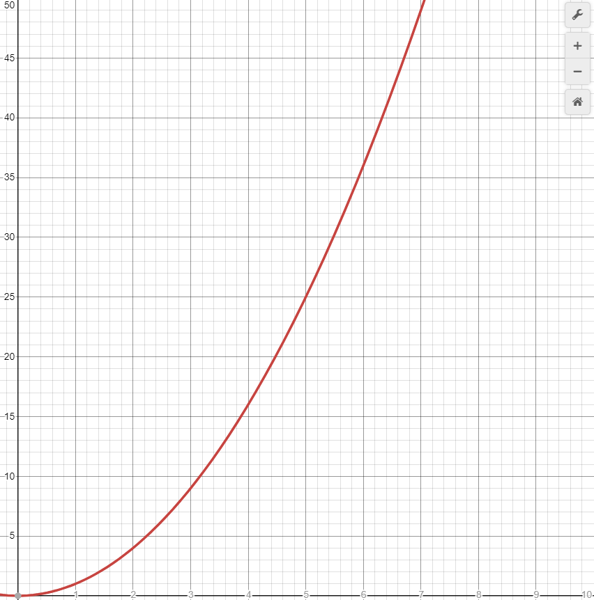
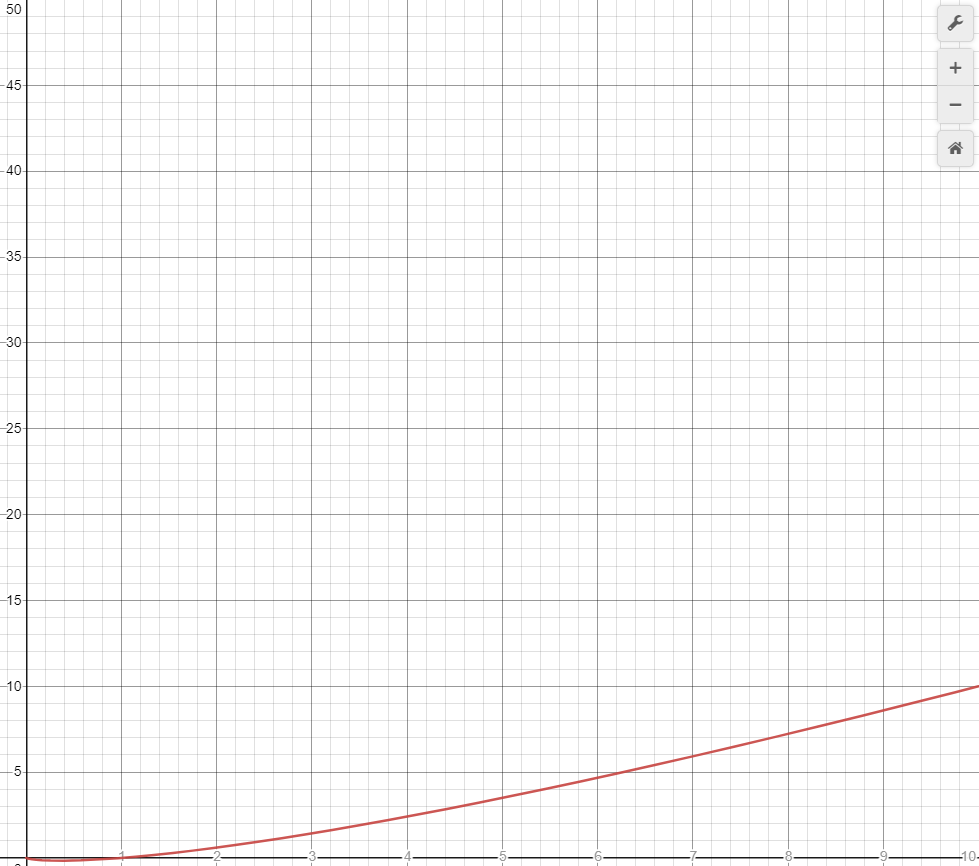
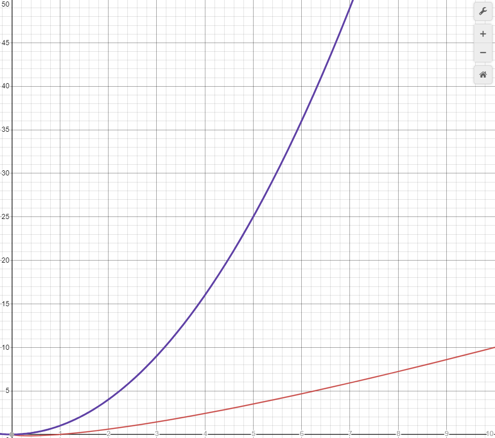

# Benchme

## Intro
Le but de se projet est de comparer les performances de différents algorithmes de trie programmés en language C.

L'indice de performance comparé ici est la compléxité temporel, ou comment évolue le temps d'éxécution en fonction du nombre de données.

>Rapelle : La compléxité temporel la plus désirable est O(n). On cherche a éviter les compléxitées avec des exposant tel que O(n^i) ou i > 2, ou pire: O(!n) 

4 algoritmes sont testé:

|Nom|Compléxité algorithmique attendue|
|---|------------------------|
|Trie à Bulle / Bubble Sort| O(n²)
|Trie par Insertion / Insertion Sort|O(n²)
|Trie par Selection / Selection Sort|O(n²)
|Trie en Tas / Heap Sort|O(n log(n))

## Utilisation

Pour appeler le programme on utilise la commande suivante: `benchme [file]`

[file]: Le nom du fichier qui contindra les résultats qui sera créé. Les résultat seront au format CSV (exploitable sous excel pour tracer des graphiques automatiquement).

## Attente

On attends des courbes représentant une fonction au carré pour 3 des 4 fontions testés (Bulle, Insertion, Selection):

Le trie en tas doit normalement avoir une courbe représentant *n log(n)* :

La différence entre ces deux types de compléxité temporel se fait ressentir avec une large quantité de donnée.

### Pour une comparaison plus parlante :
Si faire une comparaison prends ~0.1 sec

|Type de Compléxité|Nombre de valeurs|Temps (en s)|
|------------------|:-----------------:|-----:|
|O(n²)             | 10                |1     |
|O(n²)             | 100        |1000 (16mins)|
|O(n²)             | 500         |250000 (70h)|
|O(nlog(n))        | 10                |.1    |
|O(nlog(n))        | 100               |20    |
|O(nlog(n))        | 500               |135   |

